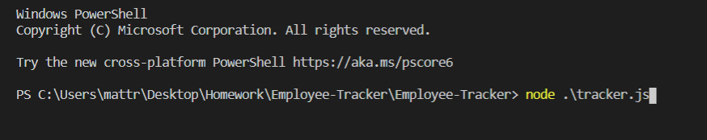
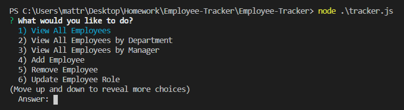

# Employee-Tracker

## The Application

* This is an application where a user can enter new employees into their database, remove employees, and adjust their information.

## Usage

* To start the program, the user would run node tracker.js, after installing the dependencies.

After running the application the user will be presented with the main menu. From here the user can select any action they need to execute.

## The Goal

* This application would allow a user to create a database with all of their employees and information. All of the information would be easily accessible via the application.

* The user would also be able to maintain their database by entering new information, deleting information they no longer need, and adjusting information when necessary.